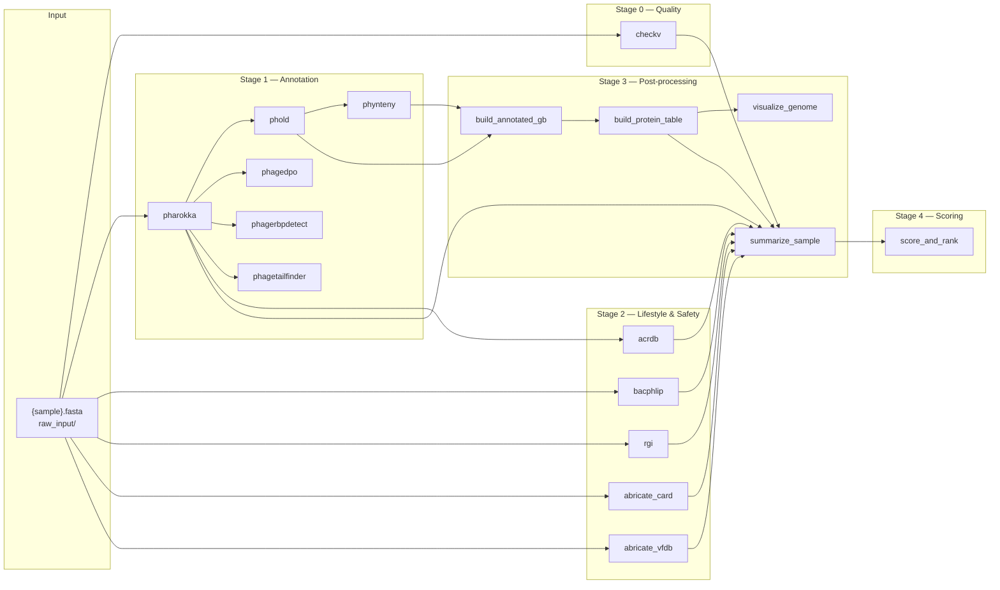

# Developer Guide — PhagePipeline

*Astraphage Innovations · Therapeutic Phage Candidate Selection Pipeline*

---

## Table of Contents

1. [Architecture Overview](#1-architecture-overview)
2. [Repository Layout — Developer Perspective](#2-repository-layout--developer-perspective)
3. [Snakemake Workflow — Rule Dependency Graph](#3-snakemake-workflow--rule-dependency-graph)
4. [Rule Anatomy](#4-rule-anatomy)
5. [Shell Wrapper Conventions](#5-shell-wrapper-conventions)
6. [Python Post-processing Scripts](#6-python-post-processing-scripts)
   - 6.1 [build_annotated_gb.py](#61-build_annotated_gbpy)
   - 6.2 [build_protein_table.py](#62-build_protein_tablepy)
   - 6.3 [visualize_genome.py](#63-visualize_genomepy)
   - 6.4 [summarize_sample.py](#64-summarize_samplepy)
   - 6.5 [score_and_rank.py](#65-score_and_rankpy)
7. [Conda Environment Map](#7-conda-environment-map)
8. [Database Layout](#8-database-layout)
9. [Vendored Tool Integration](#9-vendored-tool-integration)
10. [Adding a New Tool](#10-adding-a-new-tool)
11. [Modifying the Scoring System](#11-modifying-the-scoring-system)
12. [Known Code-level Issues and Inconsistencies](#12-known-code-level-issues-and-inconsistencies)
13. [Testing](#13-testing)

---

## 1. Architecture Overview

PhagePipeline is a Snakemake-orchestrated pipeline with a strict separation of concerns:

| Layer | Technology | Responsibility |
|-------|------------|----------------|
| Orchestration | Snakemake (Snakefile) | DAG resolution, dependency tracking, parallel execution |
| Tool invocation | Bash shell wrappers (`scripts/*/run_*.sh`) | Conda environment activation, I/O normalisation, output verification |
| Post-processing | Python 3.x scripts (`scripts/*.py`) | Parsing, merging, scoring, visualisation |
| Configuration | `config.yaml` | All paths and tunable thresholds in one place |
| Environments | Conda YAML files in `configs/` and `env/` | Reproducible dependency pinning (where available) |
| External tools | `tools/` (git clones) and system installs | Third-party bioinformatics tools |
| Databases | `databases/` (not in git) | External reference data required by tools |

The Snakemake `rule all` target defines the complete desired output set. Every other rule feeds into this.

---

## 2. Repository Layout — Developer Perspective

```
PhagePipeline/
│
├── Snakefile                        # Single workflow file; all rules defined here
├── config.yaml                      # Single config file; all tunables here
│
├── scripts/
│   ├── checkv/run_checkv.sh         # Conda env: env_checkv
│   ├── pharokka/run_pharokka.sh     # Conda env: env_pharokka
│   ├── phage/run_phold.sh           # Conda env: pholdENV
│   ├── phage/run_phynteny.sh        # Conda env: phyntenyENV
│   ├── bacphlip/run_bacphlip.sh     # Conda env: env_bacphlip
│   ├── rgi/run_rgi.sh               # Conda env: env_rgi
│   ├── abricate/run_abricate.sh     # Conda env: env_abricate
│   ├── acrdb/run_acrdb_blast.sh     # Conda env: env_acrdb
│   ├── phagedpo/run_phagedpo.sh     # Conda env: env_phage_ml
│   ├── phagerbpdetect/
│   │   └── run_phagerbpdetect_v4.sh # Conda env: env_phage_ml
│   ├── phagetailfinder/
│   │   ├── run_phagetailfinder.sh   # Conda env: env_phage_ml
│   │   └── format_fasta.py          # FASTA header normalisation helper
│   ├── utils/
│   │   ├── gbk_to_fasta.sh          # Utility: extract FASTA from GBK
│   │   └── split_cds.py             # Utility: split CDS from FASTA
│   ├── build_annotated_gb.py        # Python post-proc; conda env: phage
│   ├── build_protein_table.py       # Python post-proc; conda env: phage
│   ├── visualize_genome.py          # Python post-proc; conda env: phage
│   ├── summarize_sample.py          # Python post-proc; conda env: phage
│   └── score_and_rank.py            # Python post-proc; conda env: phage
│
├── configs/
│   ├── checkv.yaml                  # env_checkv definition
│   ├── pharokka.yml                 # env_pharokka definition
│   └── env_phage_ml.yml             # env_phage_ml definition (fully pinned)
│
├── env/
│   ├── phold_env.yml                # pholdENV definition
│   └── phynteny_env.yml             # phyntenyENV definition
│
├── tools/
│   ├── PhageRBPdetection/           # Git clone (own .git)
│   │   ├── PhageRBPdetect_v4/
│   │   │   └── PhageRBPdetect_v4_inference.py
│   │   └── data/
│   │       ├── sequences.fasta      # Shared input file — lock-protected
│   │       ├── predictions.csv      # Shared output file — lock-protected
│   │       └── RBPdetect_v4_ESMfine/  # ESM-2 model — must be downloaded separately
│   ├── PhageTailFinder/             # Git clone (own .git)
│   │   ├── scripts/predict.py       # Main inference script
│   │   ├── dbs/                     # tail_pfam and nontail_pfam — must be downloaded
│   │   └── hmmmodel/
│   └── phagedpo/                    # Git clone (own .git)
│       ├── phagedpo_cli.py          # CLI entry point
│       └── svm/                     # Pre-trained SVM model
│
└── databases/
    ├── checkv-db/                   # CheckV DIAMOND + HMM database
    ├── pharokka_db/                 # PHROG + MMseqs2 database
    ├── phold_db/                    # PHOLD structural homology database
    ├── phynteny_models/models/      # Phynteny transformer model weights
    └── acrdb_db/
        └── 122_KnownAcr/
            └── Known_Acr.faa        # 122 known anti-CRISPR proteins (BLAST formatted)
```

---

## 3. Snakemake Workflow — Rule Dependency Graph



**Key properties:**

- `pharokka` is the single most critical dependency — 6 downstream rules branch from its outputs
- `phold → phynteny` is the only sequential pair within Stage 1
- Stage 2 rules all run in parallel with each other and with Stage 1 rules
- `score_and_rank` is a global aggregation rule: it waits for ALL samples' `_tool_summary.tsv` files

---

## 4. Rule Anatomy

All Snakefile rules follow the same pattern:

```python
rule example_tool:
    input:
        genome=os.path.join(RAW_INPUT, "{sample}.fasta")
    output:
        os.path.join(RESULTS, "{sample}", "example_tool", "output_file.tsv")
    params:
        script=os.path.join(SCRIPTS, "example_tool", "run_example.sh"),
        outdir=lambda wc: os.path.join(RESULTS, wc.sample, "example_tool"),
        threads=THREADS
    log:
        os.path.join(RESULTS, "{sample}", "logs", "example_tool.log")
    shell:
        """
        mkdir -p $(dirname {log})
        {params.script} {input.genome} {wildcards.sample} {params.threads} {params.outdir} &> {log}
        """
```

**Conventions:**

- Output directories are determined by `params.outdir` using a `lambda wc:` pattern to access the `{sample}` wildcard
- All stdout and stderr are captured to the log file via `&>`
- The log directory is created with `mkdir -p $(dirname {log})`
- Python post-processing rules use `conda run -n phage python {params.script} ...` rather than a shell wrapper

The Python post-processing rules (build_annotated_gb, build_protein_table, visualize_genome, summarize_sample, score_and_rank) all use:

```
conda run -n phage python {params.script} ...
```

The `phage` conda environment name is the one used for all Python post-processing scripts. **No YAML file for this environment exists in the repository.** See [Section 7](#7-conda-environment-map).

---

## 5. Shell Wrapper Conventions

Every shell wrapper follows these conventions:

1. **Strict mode**: `set -euo pipefail` — any unset variable, failed command, or pipeline failure exits immediately
2. **Positional arguments**: args are documented inline with `${N:?Usage message}` which also serves as an error message if the argument is missing
3. **Root detection**: `ROOT=$(cd "$(dirname "${BASH_SOURCE[0]}")/../.." && pwd)` — computes the project root relative to the script's own location
4. **Output directory override**: the 3rd or 4th positional argument (depending on the script) overrides the default output directory; Snakemake always provides this
5. **FASTA validation**: all genome-input wrappers check that the first byte is `>` and exit with code 2 if not
6. **Output normalisation**: several tools write fixed-name outputs; wrappers use `cp` to rename them to `{PREFIX}.ext` for consistent Snakemake tracking

**Pharokka output normalisation** (illustrative of the pattern):

```bash
cp "$OUTDIR/phanotate.faa" "$OUTDIR/${PREFIX}.faa"
cp "$OUTDIR/phanotate.ffn" "$OUTDIR/${PREFIX}_cds.ffn"
```

**PHOLD output normalisation:**

```bash
cp "$OUTDIR/phold.gbk" "$OUTDIR/${PREFIX}.gbk"
```

---

## 6. Python Post-processing Scripts

### 6.1 build_annotated_gb.py

**Purpose:** Enriches a PHOLD-output GenBank file with two additional data sources:

1. **PHOLD confidence scores** — joined by `cds_id` (matching `locus_tag` in the GBK)
2. **Phynteny predictions** — joined by `(start, end, strand)` coordinates with ±1 bp tolerance to accommodate off-by-one differences between tools

**Key classes and functions:**

| Function | Description |
|----------|-------------|
| `load_phold_by_cds_id(tsv)` | Reads `phold_per_cds_predictions.tsv`; returns dict keyed by `cds_id` |
| `load_phynteny_by_coords(tsv)` | Reads `phynteny.tsv`; returns dict keyed by `(start, end, strand)` |
| `enrich_record(record, phold_map, phynteny_map)` | Iterates CDS features; applies both enrichments |
| `support_tier(conf)` | Maps float confidence → `high`/`medium`/`low` (thresholds: 0.6 / 0.4) |

**Dependencies:** BioPython (`Bio.SeqIO`)

---

### 6.2 build_protein_table.py

**Purpose:** Extracts all CDS features from the annotated GBK and writes a flat TSV with the best available annotation per protein.

**Priority logic:**

```
phold_known AND phynteny_known AND phold_func == phynteny_cat → PHOLD+PHYNTENY
phold_known AND phynteny_known AND phold_func != phynteny_cat → PHOLD (PHOLD wins)
phold_known only                                              → PHOLD
phynteny_known only                                           → PHYNTENY
neither                                                       → none
```

`phold_known` = PHOLD function field is not `"unknown function"`  
`phynteny_known` = Phynteny category is not `"NA"`, `"no_match"`, or empty

**Dependencies:** BioPython (`Bio.SeqIO`), `collections.Counter`

---

### 6.3 visualize_genome.py

**Purpose:** Produces linear genome maps coloured by functional category.

**Key design decisions:**

- Uses `pygenomeviz.GenomeViz` with `fig_width=20`, `fig_track_height=0.8`
- Color map is hardcoded in `CATEGORY_COLORS` dict; unmapped categories fall back to `DEFAULT_COLOR = "#D3D3D3"`
- Only the first GenBank record is used if the file contains multiple records
- PNG output at 200 dpi; SVG output at default resolution

**Dependencies:** `pygenomeviz`, `matplotlib`, BioPython

---

### 6.4 summarize_sample.py

**Purpose:** The central evidence-aggregation script. Reads outputs from 8 tools and produces a flat TSV and a narrative .txt report.

**Architecture:**

The script maintains a `rows` list. The `add(tool, metric, value, detail="", flag="")` helper appends a row dict. All data is written at the end.

**Evidence sources and their cross-checks:**

| Section | Primary Source | Cross-Check Source |
|---------|---------------|--------------------|
| Genome | CheckV quality_summary.tsv | — |
| Pharokka metrics | pharokka length_gc_cds_density.tsv | — |
| Lifestyle | BACPHLIP .bacphlip | Integrase/recombinase/transposase from protein_table.tsv |
| AMR | RGI .txt (Strict hits) | Abricate-CARD .tsv |
| Virulence | Abricate-VFDB .tsv | Toxin keywords from protein_table.tsv |
| Anti-CRISPR | AcrDB blastp .tsv (tiered by e-value) | Anti-CRISPR keywords from protein_table.tsv |
| Lysis | Named lysis proteins from protein_table.tsv | Lysis category count from protein_table.tsv |

**BACPHLIP output parsing note:**

Some BACPHLIP versions prepend an index column (`"0"`) to the tab-separated output. The script detects this by comparing `len(values)` to `len(headers) + 1` and strips the extra column if found.

**PHROG functional categories recognised:**

The script uses exact string matching against category names as they appear in the protein table. The categories are inherited from the PHROG database vocabulary used by Pharokka/PHOLD.

---

### 6.5 score_and_rank.py

**Purpose:** Reads all `_tool_summary.tsv` files and computes a final score for each sample.

**Key functions:**

| Function | Max Pts | Inputs from tool_summary.tsv |
|----------|---------|------------------------------|
| `score_quality(data)` | 20 | `CheckV / checkv_quality`, `CheckV / contamination`, `CheckV / completeness` |
| `score_lifestyle(data)` | 30 | `LifestyleConsensus / consensus`, `LifestyleConsensus / confidence` |
| `score_safety(data)` | 30 | `AMRConsensus / amr_status`, `VirulenceConsensus / virulence_status`, `AcrDB / *_hits` |
| `score_lysis(data)` | 10 | `LysisConsensus / lysis_status`, `Lysis / named_lysis_proteins`, `Lysis / lysis_category_count` |
| `score_host(data)` | 10 | `FunctionalAnnotation / cat_tail`, `FunctionalAnnotation / cat_head_and_packaging`, `FunctionalAnnotation / cat_connector` |

Data is loaded into a dict keyed by `(tool, metric)` → `(value, detail, flag)`. The `get(data, tool, metric, default)` helper abstracts safe key lookup.

**Hardcoded constants:**

```python
SCORE_PASS   = 80
SCORE_REVIEW = 50
```

These are **not read from `config.yaml`** in the current implementation. If you change the thresholds in `config.yaml`, you must also update these constants in `score_and_rank.py`.

---

## 7. Conda Environment Map

| Env Name (used in scripts) | Created From | YAML Path | Managed By |
|---------------------------|-------------|-----------|-----------|
| `env_checkv` | `configs/checkv.yaml` | `configs/checkv.yaml` | Snakemake / manual |
| `env_pharokka` | `configs/pharokka.yml` | `configs/pharokka.yml` | Snakemake / manual |
| `pholdENV` | `env/phold_env.yml` | `env/phold_env.yml` | Manual |
| `phyntenyENV` | `env/phynteny_env.yml` | `env/phynteny_env.yml` | Manual |
| `env_phage_ml` | `configs/env_phage_ml.yml` | `configs/env_phage_ml.yml` | Manual |
| `env_bacphlip` | **No YAML in repo** | — | Manual |
| `env_rgi` | **No YAML in repo** | — | Manual |
| `env_abricate` | **No YAML in repo** | — | Manual |
| `env_acrdb` | **No YAML in repo** | — | Manual |
| `phage` | **No YAML in repo** | — | Manual |

> **Note:** The `phage` environment is used by all Python post-processing rules in the Snakefile (`build_annotated_gb`, `build_protein_table`, `visualize_genome`, `summarize_sample`, `score_and_rank`). It must contain at minimum: Python 3.x, BioPython, pygenomeviz, and matplotlib. No YAML file exists in the repository.

**Inconsistency note:**

The `configs/` and `env/` directories serve the same purpose (conda environment definitions) but are split across two directories. Consolidation into a single `envs/` directory is a recommended future improvement.

---

## 8. Database Layout

```
databases/
├── checkv-db/                # Created by: checkv download_database
├── pharokka_db/              # Created by: pharokka install_databases
├── phold_db/                 # Created by: phold install_db
├── phynteny_models/
│   └── models/               # Phynteny transformer model weights
└── acrdb_db/
    ├── 122_KnownAcr/
    │   └── Known_Acr.faa     # FASTA file — must be BLAST-formatted
    ├── Predicted_Acrs_Faa/
    ├── acr_mge_db.*           # Pre-built BLAST database (larger, not used by current pipeline)
    └── acr_prophage.fasta
```

The pipeline uses **only** `databases/acrdb_db/122_KnownAcr/Known_Acr.faa` as the AcrDB BLAST target. The `acr_mge_db.*` BLAST database files present in the directory are **not referenced** by the current pipeline.

---

## 9. Vendored Tool Integration

Three tools are vendored under `tools/` as separate git repositories:

### PhageRBPdetection

- **Source:** `tools/PhageRBPdetection/`
- **Version:** v4 (inference script: `PhageRBPdetect_v4/PhageRBPdetect_v4_inference.py`)
- **Model:** `tools/PhageRBPdetection/data/RBPdetect_v4_ESMfine/` (must be downloaded separately; not in git)
- **Concurrency issue:** The inference script reads from and writes to hardcoded paths (`data/sequences.fasta`, `data/predictions.csv`). The wrapper (`run_phagerbpdetect_v4.sh`) uses `flock -x 200` on a lockfile `data/.phagerbp.lock` to serialise the inference step.
- **Post-processing:** Done inside the wrapper using an inline Python script (no file on disk); renames columns and produces both a predictions TSV and a summary TSV.

### PhageTailFinder

- **Source:** `tools/PhageTailFinder/`
- **Entry point:** `tools/PhageTailFinder/scripts/predict.py`
- **Required DBs:** `tools/PhageTailFinder/dbs/tail_pfam` and `tools/PhageTailFinder/dbs/nontail_pfam` (must be downloaded separately)
- **Filename sensitivity:** `predict.py` derives the phage ID from the **filename stem** of the input FAA. The wrapper formats headers with `format_fasta.py` and names the output file `{PREFIX}.faa` to ensure the output is named `{PREFIX}_prot_result_table.txt`.
- **Working directory requirement:** `predict.py` uses `os.path.abspath("..")` to locate its model and database files; the wrapper `cd`s to `tools/PhageTailFinder/scripts/` before invoking it.

### PhageDPO

- **Source:** `tools/phagedpo/`
- **Entry point:** `tools/phagedpo/phagedpo_cli.py`
- **Method:** SVM-based (pre-trained model in `tools/phagedpo/svm/`)
- **Input handling:** `phagedpo_cli.py` scans a directory for `.fasta` files and derives output names from the filename stem. The wrapper copies `{sample}_cds.ffn` → `{sample}_cds.fasta` in the output directory, so the HTML output lands at `{sample}_cds_output.html` in the correct location.
- **HTML → TSV conversion:** Done inside the wrapper using an inline Python script with `pandas.read_html()`.

---

## 10. Adding a New Tool

To integrate a new tool into the pipeline, follow these steps:

### Step 1 — Create a Shell Wrapper

Create `scripts/{toolname}/run_{toolname}.sh` following the existing conventions:

```bash
#!/bin/bash
set -euo pipefail

INPUT=${1:?Usage: run_mytool.sh <input.fasta> <prefix> [outdir]}
PREFIX=${2:?...}
OUTDIR=${3:-"$ROOT/results/mytool/${PREFIX}"}

ROOT=$(cd "$(dirname "${BASH_SOURCE[0]}")/../.." && pwd)

mkdir -p "$OUTDIR"

conda run -n env_mytool \
    mytool \
    --input "$INPUT" \
    --output "$OUTDIR/${PREFIX}_output.tsv"
```

### Step 2 — Add a Snakemake Rule

Add a new rule to `Snakefile`. Declare inputs, outputs, and the script path:

```python
rule my_new_tool:
    input:
        faa=os.path.join(RESULTS, "{sample}", "pharokka", "{sample}.faa")
    output:
        tsv=os.path.join(RESULTS, "{sample}", "mytool", "{sample}_output.tsv")
    params:
        script=os.path.join(SCRIPTS, "mytool", "run_mytool.sh"),
        outdir=lambda wc: os.path.join(RESULTS, wc.sample, "mytool")
    log:
        os.path.join(RESULTS, "{sample}", "logs", "mytool.log")
    shell:
        """
        mkdir -p $(dirname {log})
        {params.script} {input.faa} {wildcards.sample} {params.outdir} &> {log}
        """
```

### Step 3 — Integrate into summarize_sample.py (if needed for scoring)

If the tool produces evidence that should influence the scoring:

1. Add the output path as a new `input:` in the `summarize_sample` rule
2. Parse the output inside `summarize_sample.py` and call `add(...)` for each metric
3. Optionally create a new consensus block

### Step 4 — Integrate into score_and_rank.py (if needed for scoring)

Add a new scoring function or modify an existing one:

```python
def score_my_new_dimension(data):
    pts = 0
    notes = []
    my_metric = get(data, "MyTool", "my_metric", "0")
    # ... scoring logic ...
    return pts, "; ".join(notes)
```

Then add to the main loop and update `result_rows.append(...)`.

### Step 5 — Add the Output to rule all

Add the expected output to the `rule all` input list:

```python
expand(os.path.join(RESULTS, "{sample}", "mytool", "{sample}_output.tsv"), sample=SAMPLES),
```

### Step 6 — Create a Conda Environment

Create a YAML file in `configs/` or `env/` and document the environment name mapping in this guide.

---

## 11. Modifying the Scoring System

The scoring system has two components that must stay in sync:

### summarize_sample.py

Controls which **consensus fields** are written to `_tool_summary.tsv`. These are the inputs to the scorer. If you add a new consensus metric, ensure the `(tool, metric)` key names match exactly what `score_and_rank.py` expects.

### score_and_rank.py

Controls how consensus fields are translated into numeric points. Key areas to modify:

| What to change | Where |
|----------------|-------|
| Quality tier points | `score_quality()` — `pts` dict |
| Lifestyle point allocation | `score_lifestyle()` — if/elif chain |
| Safety penalties | `score_safety()` — `pts` deductions |
| Lysis point allocation | `score_lysis()` — if/elif chain |
| Host protein points | `score_host()` — category → points mapping |
| PASS/REVIEW thresholds | Constants `SCORE_PASS` and `SCORE_REVIEW` at the top of the file |

> **Critical:** `SCORE_PASS` and `SCORE_REVIEW` are **hardcoded** in `score_and_rank.py` and are **not read from `config.yaml`**. Update both locations if you change thresholds.

Similarly, the AcrDB e-value thresholds `ACRDB_HIGH` and `ACRDB_MEDIUM` are hardcoded in `summarize_sample.py` (as `1e-5` and `1e-3`) and are **not read from `config.yaml`** at runtime, despite being documented in the config file.

---

## 12. Known Code-level Issues and Inconsistencies

| Issue | Location | Impact | Status |
|-------|----------|--------|--------|
| `SCORE_PASS` / `SCORE_REVIEW` hardcoded | `score_and_rank.py` lines 29–30 | Changing `config.yaml` thresholds has no effect on scoring | Open |
| AcrDB e-value thresholds hardcoded | `summarize_sample.py` lines 32–33 | `config.yaml` `acrdb_high_evalue` / `acrdb_medium_evalue` not read at runtime | Open |
| `bacphlip_temperate_threshold` not read from config | `summarize_sample.py` line 160 | Threshold hardcoded as 0.6 | Open |
| `env/` and `configs/` split | Two directories | YAML files for conda environments are split across two directories without a clear convention | Open |
| `phage` conda environment has no YAML | All Python post-proc rules | Cannot be reproducibly recreated from the repository alone | Open |
| `env_bacphlip`, `env_rgi`, `env_abricate`, `env_acrdb` have no YAMLs | Shell wrappers | Same as above | Open |
| `tool_reg.md` outdated | Repo root | Lists tool status that differs from actual implementation | Document-only |
| `run_all_ml_tools.sh` references old paths | `scripts/run_all_ml_tools.sh` | Hard-codes `results/smoke_tests/phagedpo/cds_input` which does not match current pipeline I/O | Low impact |
| PhageTailFinder `dbs/` files not in git | `tools/PhageTailFinder/dbs/` | Must be obtained separately; pipeline fails if missing | Blocker for PhageTailFinder |
| PhageRBPdetect v4 model not in git | `tools/PhageRBPdetection/data/` | Must be obtained separately; pipeline fails if missing | Blocker for PhageRBPdetect |

---

## 13. Testing

### Current Test Data

`test_data/lambda_proteins.faa` — Lambda phage protein FASTA. This can be used to test protein-level tools (AcrDB, PhageTailFinder, PhageRBPdetect) independently of the full pipeline.

### Running a Dry-Run

```bash
snakemake --cores 1 \
    --config samples="Lambda" run_id="test_$(date +%Y-%m-%d)" \
    --dry-run
```

### Testing Individual Wrappers

Each shell wrapper can be invoked independently from the project root. Example:

```bash
bash scripts/checkv/run_checkv.sh raw_input/Lambda.fasta Lambda 4
bash scripts/pharokka/run_pharokka.sh raw_input/Lambda.fasta Lambda 4
bash scripts/acrdb/run_acrdb_blast.sh test_data/lambda_proteins.faa Lambda
```

### Log Files

All tool logs are written to `results/{sample}/logs/{tool}.log`. The `score_and_rank` log is at `results/logs/{run_id}_score_and_rank.log`.

Inspect logs for tool-specific errors before filing issues.

---

*Astraphage Innovations — Internal Use*
